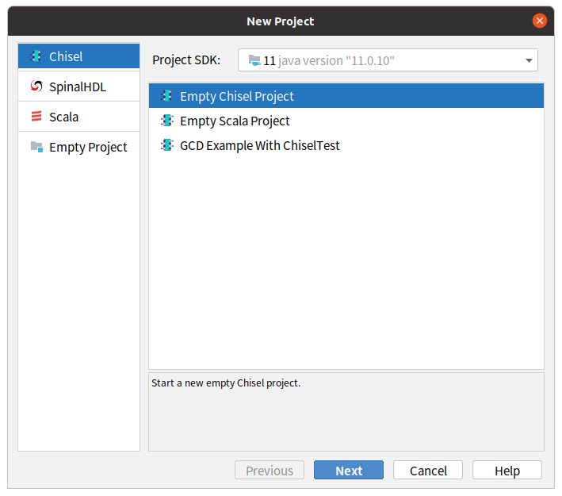

## Welcome to EasySoC CHIP

EasySoC CHIP is an Integrated Development Environment (IDE)  and front-end EDA tool for Modern Hardware Design, based on [IntelliJ IDEA](https://www.jetbrains.com/idea/). Just like [Android Studio](https://developer.android.com/studio) is the official IDE for Android app development.  On top of IntelliJ's powerful code editor and developer tools, EasySoC CHIP offers even more features that enhance the productivity of ASIC and FPGA design, such as:

- Create new Chisel / SpinalHDL projects based on ProjectWizard and Templates
- File menu for quickly create Chisel / SpinalHDL circuit modules
- Open / Search API Documentation in the editor
- Firrtl Syntax highlighting, Code folding and Navigate to corresponding Chisel code
- Visualizing Chisel generated Firrtl circuits by interactive diagrams
- ……

With IntelliJ's rich [Plugin](https://plugins.jetbrains.com/) ecosystem, support for languages and tools such as GNU Make, SystemVerilog, and Python is stronger than almost any other editors.

## Download

see [Releases](https://github.com/easysoc/chip/releases)

## Motivation

IntelliJ IDEA is a professional editor for JAVA Web programmers rather than hardware designers. By default, it contains many unnecessary functions, which make circuit designers confused and annoyed.

Since the interface and functions of the IDE seem so complicated, many new users choose to stay away from the IDE and choose some lightweight editors such as VS Code. However, these lightweight editors are weaker than IntelliJ IDEA in many aspects, especially code insight and code analysis. These features are important for complex languages like Scala. 

Due to the use of a weak editor, users find it difficult to learn emerging hardware design languages like Chisel / SpinalHDL, and many of them go from being interested to giving up. EasySoC CHIP wants to change the situation by streamlining the IDE and adding some features that helpful for hardware design. We see it as step one of a bigger picture and dream about extending it by integrating with more open source EDA tools in the future. **Stay tuned for further updates!**

